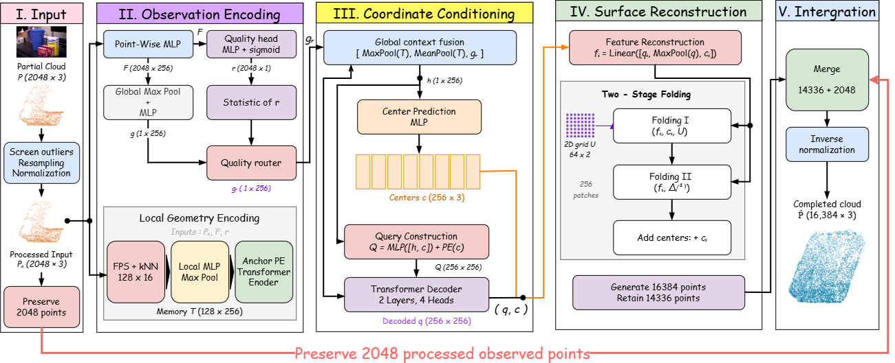

<p align="center">
  
</p>

<h1 align="center">VEIL-Net</h1>

<p align="center">
  <strong>Visible-to-Entire Surface Inference via Local Geometry<br>for Occluded 3D Objects</strong>
</p>

<p align="center">
  <a href="pyproject.toml">
    
  </a>
  <a href="pyproject.toml">
    
  </a>
  <a href="LICENSE">
    
  </a>
</p>

VEIL-Net completes an occluded object's surface from a partial point cloud.
Local geometric features and coordinate-conditioned queries guide surface-patch
generation, while observed points are retained in the output.
The model maps **2,048 input points to 16,384 surface points** using native PyTorch.

<p align="center">
  
</p>

*The network receives the partial object cloud. RGB-D reconstruction and object
segmentation are upstream steps, not inputs required by the completion model.*

## Architecture

<p align="center">
  <a href="figures/veil-net-architecture.drawio.png"></a>
</p>

*Observation encoding and coordinate-conditioned surface generation with an
observed-point preservation path.*

## Qualitative comparison

<p align="center">
  <a href="figures/qualitative-comparison.png"></a>
</p>

*Author-provided qualitative comparison, with labels preserved as supplied.*

## Installation

Python 3.10+ and PyTorch 2.3+ are required. Install a PyTorch build suitable for
your CPU or GPU, then run:

```bash
git clone https://github.com/HaeinSeo/VEIL-Net.git
cd VEIL-Net
python -m pip install -e ".[dev,hub]"
python -m veil_net smoke
```

The smoke test checks forward/backward passes and a weight export round trip.
It needs no dataset or pretrained weights. **This repository contains source
code, not pretrained weights or datasets.**

## Usage

### Inference

Place exported `config.json` and `model.safetensors` files in `model/`:

```bash
python -m veil_net infer --model model --input partial.npy --output results/completion.npz
```

Add `--device cuda` for GPU inference. The output key is `prediction_complete`.

```python
import numpy as np

from veil_net import VEILNet
from veil_net.inference import predict

model = VEILNet.from_pretrained("model")
complete = predict(model, np.load("partial.npy", allow_pickle=False))["prediction_complete"]
```

### Training

```bash
python -m veil_net train --config configs/train.yaml --pairs data/train --device cuda
```

The configuration trains from scratch. Add `--resume` to continue the same run;
use a different `run_name` in the configuration for a new experiment.

### Evaluation

For prepared pairs matching the reference cohort:

```bash
python -m veil_net evaluate --model model --pairs data/val --protocol configs/validation.json --max-samples 0 --eval-points 4096 --device cpu --output results/validation
```

For your own validation split, omit `--protocol`. Reports contain per-observation
metrics, sample IDs, and model/data hashes. Always keep coordinate units and
sampling settings consistent when comparing results.

### Checkpoint export

```bash
python -m veil_net export --checkpoint checkpoints/veil_geometry/seed_0/last.pt --output model
```

Export writes portable weights, configuration, a model card, and provenance.
Existing checkpoint parameter names are preserved.

## Data format

Inference accepts a finite `[N, 3]` XYZ array in `.npy`, or a `.npz` file with a
`partial` array. Each input must describe one segmented object. The model
normalizes its input internally and restores the original frame and units.

Training and evaluation use one `.npz` file per observation:

| Key | Shape | Purpose |
| --- | --- | --- |
| `partial` | `[2048, 3]` | Observed XYZ points |
| `complete` | `[16384, 3]` | Registered target surface |
| `risk_target` | `[2048]` | Optional observation-quality supervision |

Use unique sample IDs and disjoint training/validation observations. A complete
target is used for training and evaluation, never as an inference input.

## Code

```text
veil_net/
  models/       Point encoder, local geometry, surface decoder, preservation
  losses/       Geometry, coverage, and observation-quality losses
  training/     Training loop and checkpoint handling
  evaluation/   Metrics and reproducible evaluation
  datasets/     Optional training-pair audit
  utils/        I/O, point sampling, and reproducibility helpers
  model.py      VEILNet and portable weight loading
  cli.py        Training, inference, evaluation, and export commands
configs/        Training recipe and reference evaluation protocol
tests/          Model, API, metric, and training regression tests
figures/        Project mascot, architecture, and qualitative examples
```

```bash
python -m pytest -q
python -m ruff check
python -m build
```
## References

[1] T. Hodaň, P. Haluza, Š. Obdržálek, J. Matas, M. Lourakis, and X. Zabulis, “T-LESS: An RGB-D Dataset for 6D Pose Estimation of Texture-less Objects,” IEEE Winter Conference on Applications of Computer Vision (WACV), 2017.

[2] T. Hodaň et al., “BOP: Benchmark for 6D Object Pose Estimation,” European Conference on Computer Vision (ECCV), 2018.

[3] Y. Xiang, T. Schmidt, V. Narayanan, and D. Fox, “PoseCNN: A Convolutional Neural Network for 6D Object Pose Estimation in Cluttered Scenes,” Robotics: Science and Systems (RSS), 2018.

[4] X. Yu, Y. Rao, Z. Wang, Z. Liu, J. Lu, and J. Zhou, “PoinTr: Diverse Point Cloud Completion with Geometry-Aware Transformers,” Proceedings of the IEEE/CVF International Conference on Computer Vision (ICCV), pp. 12498–12507, 2021.

[5] P. Xiang, X. Wen, Y.-S. Liu, Y.-P. Cao, P. Wan, W. Zheng, and Z. Han, “SnowflakeNet: Point Cloud Completion by Snowflake Point Deconvolution with Skip-Transformer,” Proceedings of the IEEE/CVF International Conference on Computer Vision (ICCV), pp. 5499–5509, 2021.


## License

Original code is released under the MIT License.
Dataset and baseline terms are listed in [third-party notices](THIRD_PARTY_NOTICES.md).
