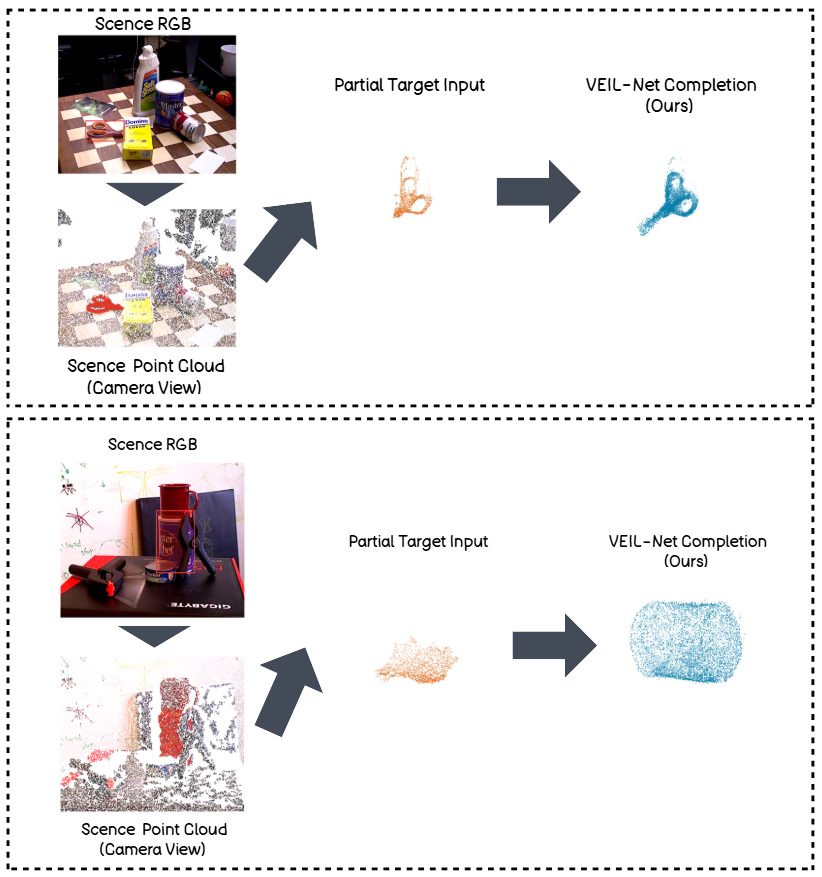
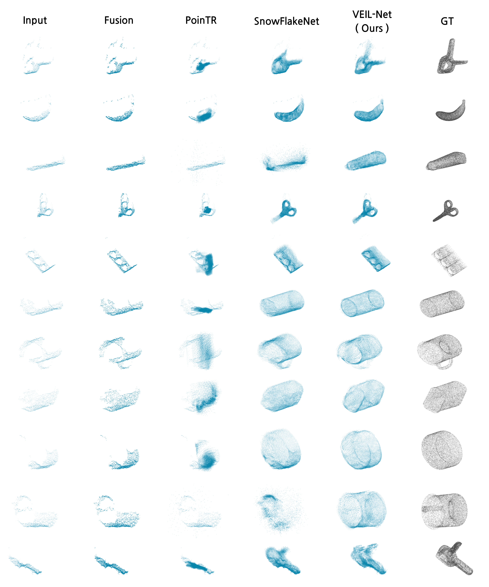

<p align="center">
  
</p>

<h1 align="center">VEIL-Net</h1>

<p align="center">
  <strong>Visible-to-Entire Surface Inference via Local Geometry<br>for Occluded 3D Objects</strong>
</p>

<p align="center">
  <a href="https://github.com/HaeinSeo/VEIL-Net/actions/workflows/tests.yml"></a>
  <a href="pyproject.toml"></a>
  <a href="pyproject.toml"></a>
  <a href="LICENSE"></a>
</p>

<p align="center">
  <a href="#overview">Overview</a> &middot;
  <a href="#results">Results</a> &middot;
  <a href="#getting-started">Getting started</a> &middot;
  <a href="docs/ARCHITECTURE.md">Method</a> &middot;
  <a href="docs/TRAINING.md">Training</a> &middot;
  <a href="README_KO.md">한국어</a>
</p>

## Overview

A partial scan records the visible surface of an object, not its full shape.
VEIL-Net uses local surface geometry and coordinate-conditioned queries to infer
the missing surface while retaining observed points. It takes **2,048 XYZ points**
and returns **16,384 points** in the input coordinate frame.

The model operates on an object-level point cloud. RGB-D acquisition, scene
reconstruction, and object segmentation are upstream steps; inference does not
require RGB, a complete target, or object dimensions.

<p align="center">
  
</p>

*From scene observations to completed object surfaces. Author-provided examples;
the network receives the partial target cloud shown in orange.*

### Method at a glance

1. **Encode local geometry.** Point features, relative coordinates, and local
   geometric descriptors form a spatial observation memory.
2. **Query the missing surface.** Predicted patch centers condition decoder
   queries that attend to the observed geometry.
3. **Generate and preserve.** Two-stage folding produces surface patches, which
   are combined with screened and resampled observations.

The implementation uses native PyTorch operations, with no project-specific
CUDA extension. See the [architecture](docs/ARCHITECTURE.md) for the full data flow.


### Qualitative comparison

<p align="center">
  <a href="figures/qualitative-comparison.png"></a>
</p>

*Author-provided qualitative comparison. Columns follow the labels in the supplied
figure; the quantitative table above uses the task-finetuned SnowflakeNet baseline.
Open the image for the full-resolution version.*

## Getting started

Use Python 3.10 or later and install a PyTorch build appropriate for your CPU or
GPU, then install the project:

```bash
git clone https://github.com/HaeinSeo/VEIL-Net.git
cd VEIL-Net
python -m pip install -e ".[dev,hub]"
python -m veil_net smoke
```

The smoke test runs a small model through forward/backward passes and a
safetensors round trip. It does not need a dataset, pretrained weights, or a GPU.

**Weights:** this Git repository contains source code and evaluation records,
not pretrained weights or datasets. The inference examples below require an
exported model directory containing `config.json` and `model.safetensors`.
The [training guide](docs/TRAINING.md) covers training and checkpoint export.

### Complete a point cloud

With exported weights in `model/` and a finite `[N, 3]` XYZ array in `partial.npy`:

```bash
python -m veil_net infer --model model --input partial.npy --output results/completion.npz
```

Add `--device cuda` for GPU inference. The same interface is available in Python:

```python
import numpy as np

from veil_net import VEILNet
from veil_net.inference import predict

model = VEILNet.from_pretrained("model")
result = predict(model, np.load("partial.npy", allow_pickle=False))
complete = result["prediction_complete"]  # [16384, 3], input frame and units
```

### Evaluate

For prepared validation pairs matching the published protocol:

```bash
python -m veil_net evaluate --model model --pairs cache/completion_pairs/val --protocol benchmarks/validation_protocol.json --max-samples 0 --eval-points 4096 --device cpu --output results/full-validation
python scripts/verify_paper_results.py --report results/full-validation/report.json --reference saved
```

Evaluation writes a per-observation CSV and a JSON report with model and data
hashes. See the [data format](docs/DATA_FORMAT.md) before preparing your own pairs.
The comparison command checks reproduction of the saved reference, not whether
a newly trained model is better.

### Train

```bash
python -m veil_net train --config configs/release/veil_geometry.yaml --pairs cache/completion_pairs/train --device cuda
```

This is a standalone training recipe. The reference checkpoint used staged
fine-tuning; running this recipe alone is not an exact replay of that training.
See [training and fine-tuning](docs/TRAINING.md) for initialization, evaluation,
and the bounded target-metric search.

## Repository

```text
veil_net/          Public API, command-line interface, portable model loading
rapc_net/          Model, losses, data loading, and training implementation
configs/release/   Training and fine-tuning configurations
benchmarks/        Result tables, fixed evaluation protocol, and provenance
figures/           Project mascot and qualitative results
scripts/           Evaluation checks, training search, and release tools
tests/             Model, metric, serialization, and packaging tests
docs/              Method, data format, results, and release documentation
```

The internal `rapc_net` namespace is retained for checkpoint compatibility;
the public model class is `VEILNet`.

## Development

```bash
python -m pytest -q
python -m ruff check
python -m build
```

The test suite uses synthetic inputs and temporary checkpoints. GitHub Actions
checks Linux and Windows with Python 3.10 and 3.12. See [contributing](CONTRIBUTING.md)
for changes to model behavior or benchmark reporting.

## License and attribution

Original project code is available under the [MIT License](LICENSE). Datasets
and external baselines retain their own terms; see [third-party notices](THIRD_PARTY_NOTICES.md).
The mascot and qualitative figures were supplied by the project author; their
source files are documented in [figure notes](figures/README.md).

For software citations, use [CITATION.cff](CITATION.cff).
