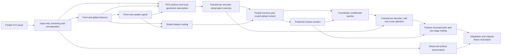

# Architecture

VEIL-Net treats a partial cloud as observed surface evidence. It predicts 3D
surface points for a segmented object, including regions hidden by occlusion.

## Components

| Component | Role | Implementation in `rapc_net/models/` |
| :--- | :--- | :--- |
| Input geometry | Screen radial outliers; compute an input-only similarity frame | `input_geometry.py`, `rapc_net.py` |
| Point features | Encode observed XYZ coordinates | `geometry_encoder.py` |
| Observation quality | Condition feature routing and preservation | `risk_estimator.py`, `quality_router.py` |
| Local geometry | FPS anchors, kNN relative coordinates, normal, covariance spectrum, density | `spatial_completion.py` |
| Spatial queries | Predict patch centers; condition queries on center coordinates | `spatial_completion.py` |
| Surface generation | Decode local surface patches with two folding stages | `spatial_completion.py` |
| Observed integration | Retain selected observed points and combine with generated geometry | `preservation_module.py` |

The default geometry-query model uses 128 anchors, up to 16 neighbors per anchor,
256 patch centers, and a hidden dimension of 256. Predicted centers tell the
decoder where a query applies; cross-attention connects that query to observed
geometry. Patch points are interleaved before observed-point integration, so
truncation does not simply discard whole patches.

The point-wise quality head runs on encoder features before neighborhood grouping.
Routing uses the global feature and four quality statistics, not a separate expert
decision for each local token. Local tokens concatenate point features, relative
coordinates, the quality signal, and seven geometric descriptor values. Query
context combines max/mean pooled observation memory and the routed global feature.
Predicted centers condition queries and folding; they are not supplied by GT.

The two folding stages predict offsets; adding patch centers produces generated
coordinates. With the released configuration, integration retains 2,048
screened/resampled observations plus 14,336 generated points. Preserved observations
are not necessarily the original unscreened input set.

The observation-quality module retains `risk` names in the implementation and
checkpoint keys. In the released configuration, uncertainty is reported without
moving the generated points, and observation-bounding-box clipping is disabled.

## Public API

`VEILNetConfig()` selects the geometry-query configuration. `RAPCNetConfig()`
retains historical defaults. `VEILNet.from_checkpoint()` always reconstructs
the saved configuration and performs strict state-dict loading. The public
class inherits the implementation without changing its parameter names.

| Entry point | Input | Output |
| :--- | :--- | :--- |
| `model(partial)` | Float tensor `[B, N, 3]` | Dictionary including `completed_points` |
| `predict(model, points)` | NumPy XYZ `[N, 3]` | NumPy arrays including `prediction_complete` |
| `from_checkpoint(path)` | Original training checkpoint | Evaluation-mode model |
| `save_pretrained(directory)` | Empty directory | Config and safetensors weights |
| `from_pretrained(source)` | Export directory or Hub model ID | Evaluation-mode model |

`predict` deterministically samples to `config.input_points`. The raw tensor
forward path expects callers to handle sampling and evaluation mode. A full
target surface is used only by training losses and evaluation metrics.
